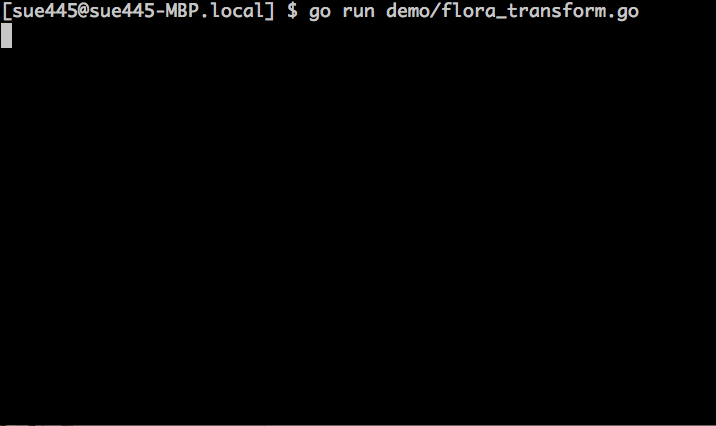
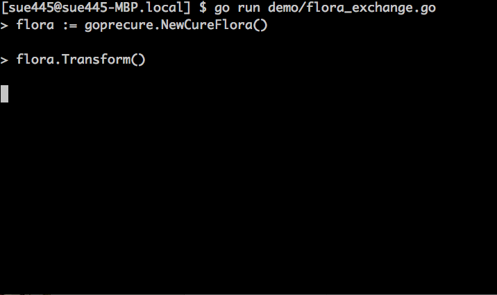

# GoPrecure
goprecure is golang implementation of [Go! Princess PreCure](https://en.wikipedia.org/wiki/Go!_Princess_PreCure)

[](https://travis-ci.org/sue445/goprecure)
[](https://coveralls.io/github/sue445/goprecure?branch=master)

## Install
```sh
$ go get github.com/sue445/goprecure
```

## Usage
via. [gore](https://github.com/motemen/gore)

```go
gore> :import github.com/sue445/goprecure
gore> flora := goprecure.NewCureFlora()
gore> flora.Name()
"春野はるか"

gore> flora.Transform()
プリキュア！プリンセスエンゲージ！
咲き誇る花のプリンセス！キュアフローラ！
強く、やさしく、美しく！
Go!プリンセスプリキュア！
冷たい檻に閉ざされた夢、返していただきますわ！
お覚悟はよろしくて？

gore> flora.Name()
"キュアフローラ"

gore> flora.Exchange(goprecure.Flora)
エクスチェンジ！モードエレガント！
舞え、花よ！プリキュア・フローラル・トルビヨン！
ごきげんよう

gore> ret, err = flora.Exchange(goprecure.Mermaid)
gore> err
&errors.errorString{
  s: "キュアフローラ can not use Mermaid",
}
```

## Demo
### Transform


[demo/flora_transform.go](demo/flora_transform.go)

### Exchange


[demo/flora_exchange.go](demo/flora_exchange.go)

## More examples
* [cure_flora_test.go](cure_flora_test.go)
* [cure_mermaid_test.go](cure_mermaid_test.go)
* [cure_twinkle_test.go](cure_twinkle_test.go)
* [cure_scarlet_test.go](cure_scarlet_test.go)

## Development

```sh
$ go get github.com/mattn/gom
$ gom install

$ export GOPATH="`pwd`/_vendor":$GOPATH
$ _vendor/bin/gore
```

## License
MIT

## Presentations / Articles
### in Japanese
* [GoがGoでGo!プリンセスプリキュアを作った #gocon #cure_advent - くりにっき](http://sue445.hatenablog.com/entry/2015/12/07/000000)  ([slide ver](https://sue445.github.io/gocon2015-winter/))
